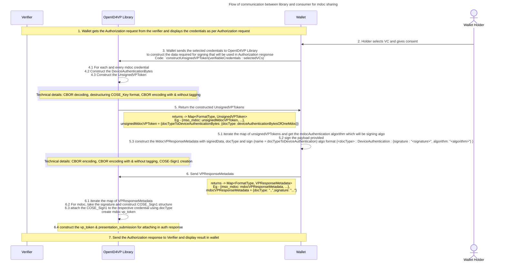

#  Folder / renaming elevel level changes

1. verifier DTO moved to Authorizaton request folder
2. VPResponseMetadata renamed to VPTokenSigningResult
    -> input of vpResponseMetadata will be a map of format to VPTokenSigningResultOfFormat
    ref - https://mosip.atlassian.net/wiki/spaces/Inji/pages/1574371371/Draft+21+to+Draft+23+migration+changes#Changes-Summary-as-per-discussion
3. VPTokenForSigning renamed to UnsignedVPToken
    -> return of createUnsignedVPTokens will have map of format to unsignedVPTOkenOfFormat
    ref - https://mosip.atlassian.net/wiki/spaces/Inji/pages/1574371371/Draft+21+to+Draft+23+migration+changes#Changes-Summary-as-per-discussion
4. credentialsMap format
    prev [<input_decriptor_id>: [matchingCredentials]]
    curr [<input_decriptor_id>: [<format> : [matchingCredsOfFormat]]]

## Mdoc support

### Flow of communication between library and consumer for mdoc sharing

